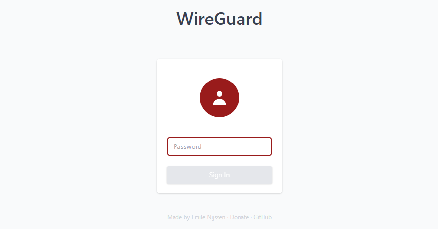
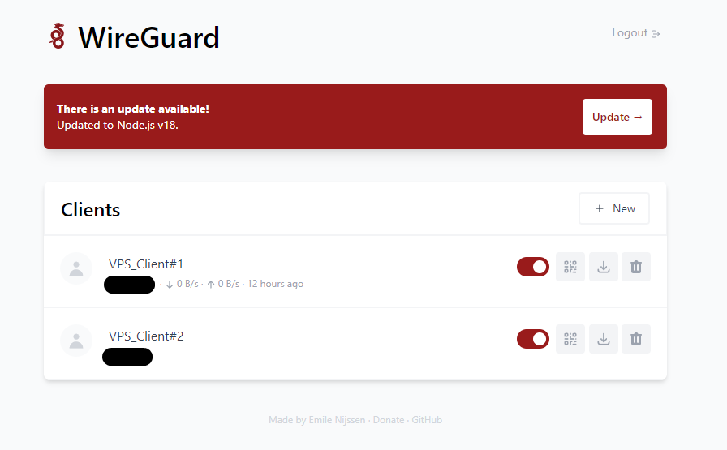

# Installing and configuring WireGuard VPN on the server

The first thing to do is download and install WireGuard on the server.

```bash
curl -sSL https://get.docker.com | sh
```
This command installs Docker on your system if it is supported.
```bash
sudo usermod -aG docker $(whoami)
```
This command adds the current user to the docker group.

Next, you need to log out of the server and log in to it again.

After logging in again, you need to edit the script that will launch the docker container with WireGuard.

```bash
docker run -d \
  --name=wg-easy \
  -e WG_HOST=YOUR_SERVER_IP \
  -e PASSWORD=YOUR_ADMIN_PASSWORD \
  -v ~/.wg-easy:/etc/wireguard \
  -p 51820:51820/udp \
  -p 51821:51821/tcp \
  --cap-add=NET_ADMIN \
  --cap-add=SYS_MODULE \
  --sysctl="net.ipv4.conf.all.src_valid_mark=1" \
  --sysctl="net.ipv4.ip_forward=1" \
  --restart unless-stopped \
  weejewel/wg-easy

```
- In the WG_HOST field, instead of YOUR_SERVER_IP, you must specify the IP address of your server.
- In the PASSWORD field, instead of YOUR_ADMIN_PASSWORD, you must specify the password that will be used to log in to the WireGuard web interface.

We insert the edited script into the terminal.


# Usage VPN
Go to the browser and enter in the search bar:
```bash
http://0.0.0.0:51821
```
The zeros must be replaced with the ip address of your server.

The login page for the WireGuard web interface opens.\


After entering the password, you will be redirected to the VPN management page, from where you can create configuration files.


### Great! now we have a working VPN that is located on our server. 🎉🎉🎉